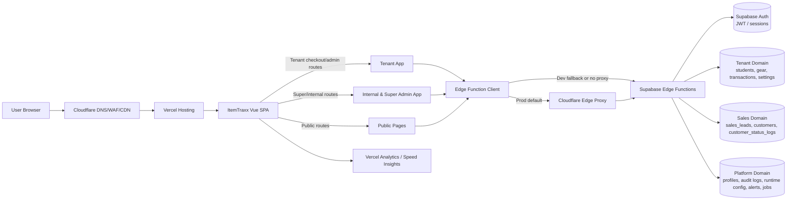
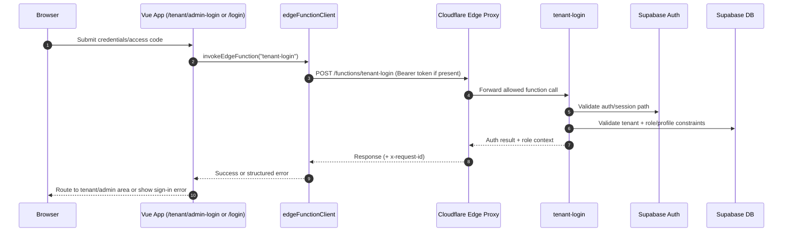
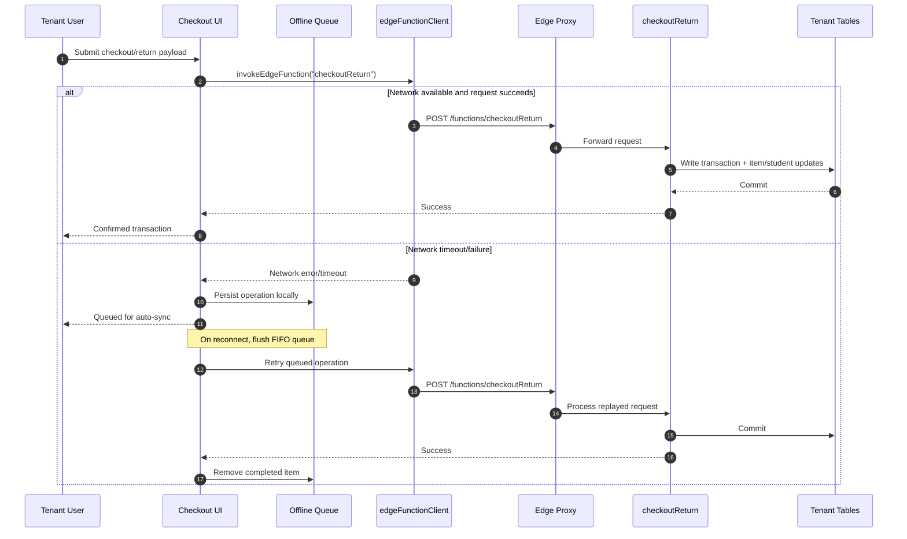
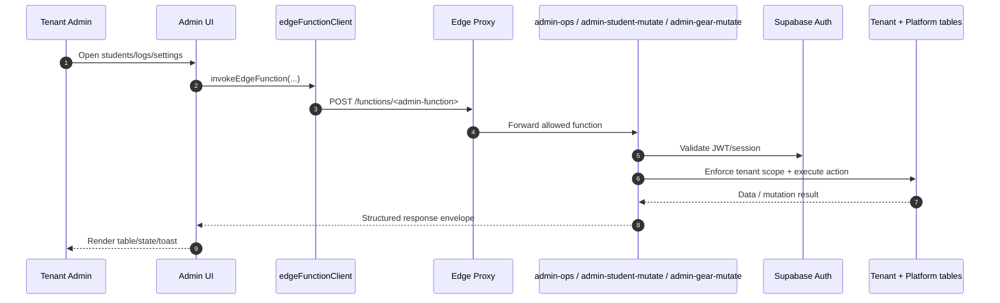
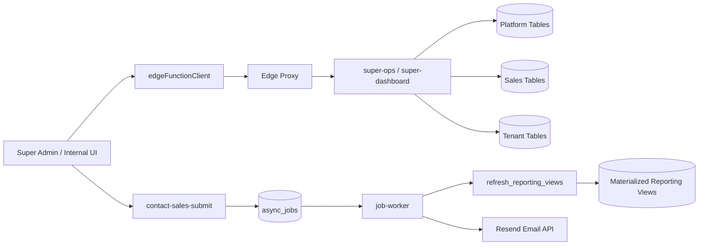
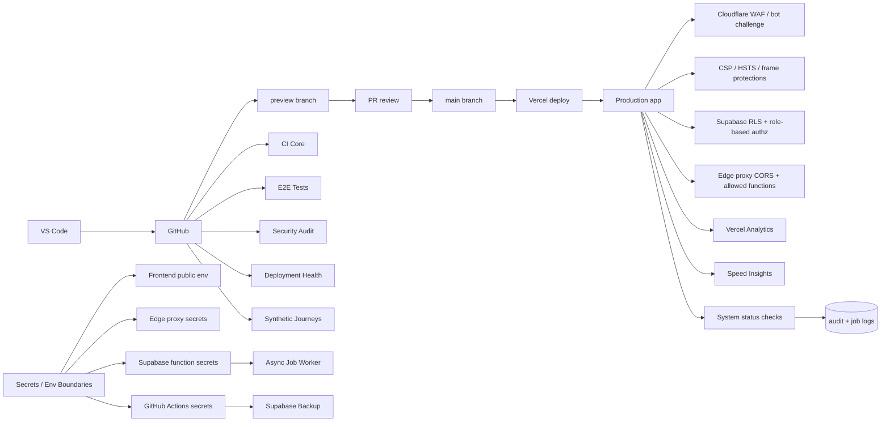
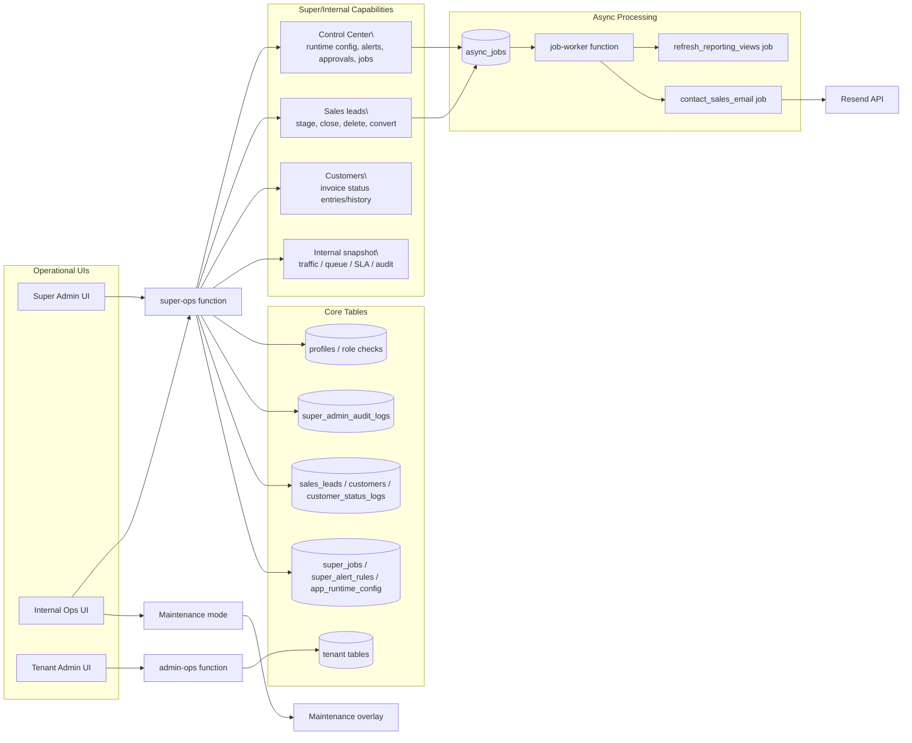
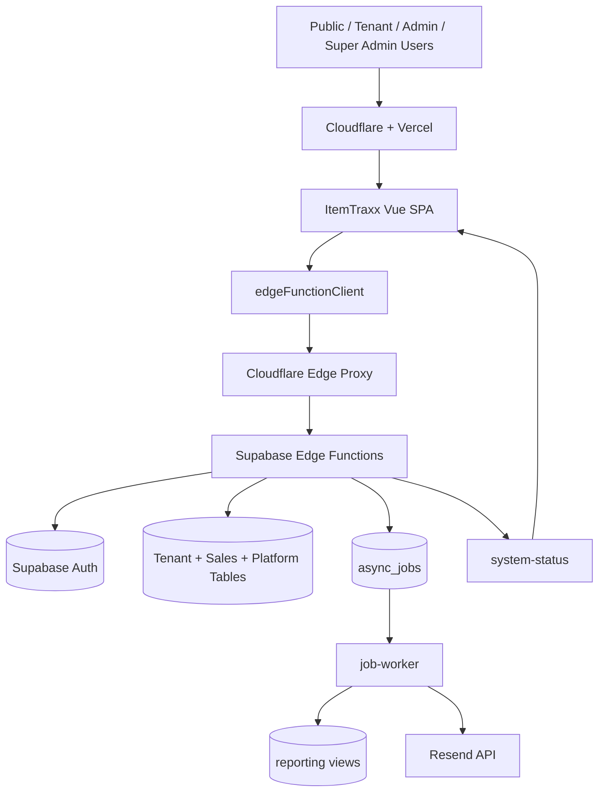

# System Architecture Overview

This document describes the high-level ItemTraxx architecture across frontend, edge functions, and Supabase data domains, plus the core request flows.

## 1) Runtime Topology

## 2) Primary Edge Functions

- Tenant-facing:
  - `tenant-login`
  - `checkoutReturn`
  - `admin-ops`
  - `admin-student-mutate`
  - `admin-gear-mutate`
- Super/internal:
  - `super-ops`
  - `super-dashboard`
  - `super-tenant-mutate`
  - `super-student-mutate`
  - `super-gear-mutate`
- Platform/public:
  - `system-status`
  - `contact-sales-submit`
  - `job-worker`

## 3) Request Flow: Tenant Login

## 4) Request Flow: Checkout / Return (+ Offline Buffer)

## 5) Request Flow: Tenant Admin Data Operations

## 6) Request Flow: Super/Internal + Async Jobs

## 7) Security Boundaries (At a Glance)

- Edge ingress control:
  - Cloudflare WAF/challenge at public edge.
  - Proxy allowlist restricts exposed function surface.
- Application security:
  - JWT/session checks in edge handlers.
  - Role/tenant scope enforcement in server logic.
- Data security:
  - Supabase RLS and role-based access.
  - Platform audit logs and runtime controls for privileged operations.

## 8) Operational Notes

- `edgeFunctionClient` includes:
  - request timeout guard
  - request ID propagation (`x-request-id`)
  - one-time token refresh retry on 401
  - dev fallback from proxy to direct Supabase functions when configured
- Status and observability:
  - `system-status` supports in-app status indicator and operational checks
  - CI + E2E + security workflows gate preview/main changes

## 9) CI/CD, Security, and Environment Boundaries

## 10) Super/Internal and Async Processing Flow

## 11) Combined End-to-End View (Simplified)

